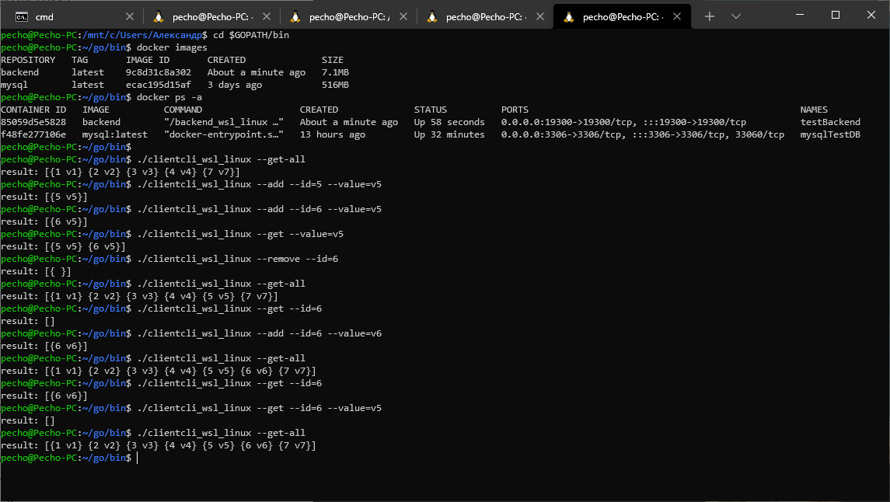

#TestService

### Описание задачи

Необходимо собрать docker контейнеры и написать 2 простых микро-сервиса:

1) контейнер с БД (любой)

2) контейнер с backend - с одного конца работает с БД, с другого конца REST. Данные которые необходимо сохранять в БД могут быть любые, на свой выбор. Можно просто ключ : значение.

3) CLI клиент, с помощью которого можно записать/прочитать/удалить данные из БД (например, по ключу значения доставать)

CLI должна работать с backed-ом через REST и поддерживать следующие параметры запуска: --host --port --id --value --add/get/get-all/remove

### Моя среда разработки

JB GoLand (on Windows) + WSL2(Ubuntu 18.04)

### Что нужно, чтобы запустить

#### 1. Контейнер с базой данный

Я взял за основу стандартную официальную сборку MySQL, так как эта БД мне привычна, и по условию можно. Поскольку она занимает большой объем памяти и в открытом доступе, я не прилагаю tar с образом. Взамен предлагаю скрипт `install_test_db.sh`, который правильным образом настраивает контейнер с БД. 
Он скачивает при необходимости образ *mysql:latest* (внимание: трафик 516 мб), запускает его в фоне согласно конфигу `docker-compose.mysql.yml`, восстанавливает БД `test_db` согласно sql-скрипту `test_db.sql`. Относительно большая временная задержка внутри скрипта нужна для того, чтобы дать контейнеру время для инициализации.
Для корректной работы необходимо **перед** запуском `install_test_db.sh` внести изменение в `docker-compose.mysql.yml`, указав вашу текущую директорию как том (см 10ю строчку). 

#### 2. Контейнер с backend'ом

Создайте папку `config`, скопируйте в неё файл `dbconfig.json`. Внесите в него правку, отредактировав IP адрес хоста, указав IP вашего интерфейса `docker0`.
Установите образ командой `docker load -i backend.tar`. Для запуска воспользуйтесь `docker-compose.backend.yml` с ключем -d. **Перед** запуском отредактируйте `docker-compose.backend.yml`, указав вашу  директорию с папкой  `config` как том (см 9ю строчку). 

### Пример работы CLI клиента с контейнерами:

